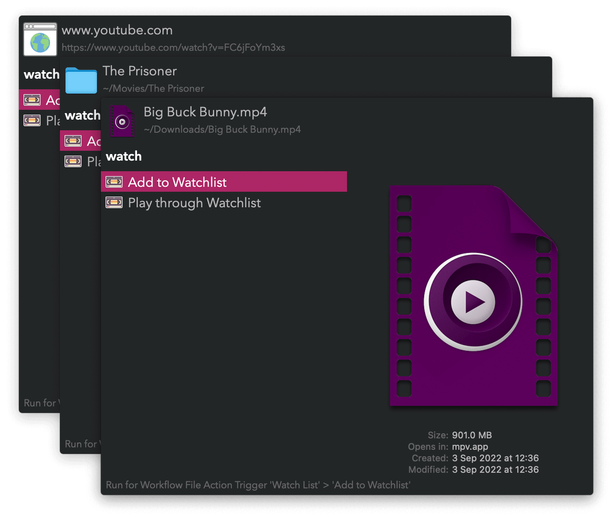
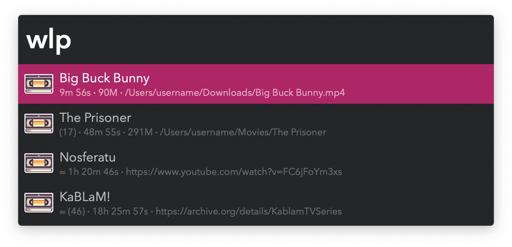
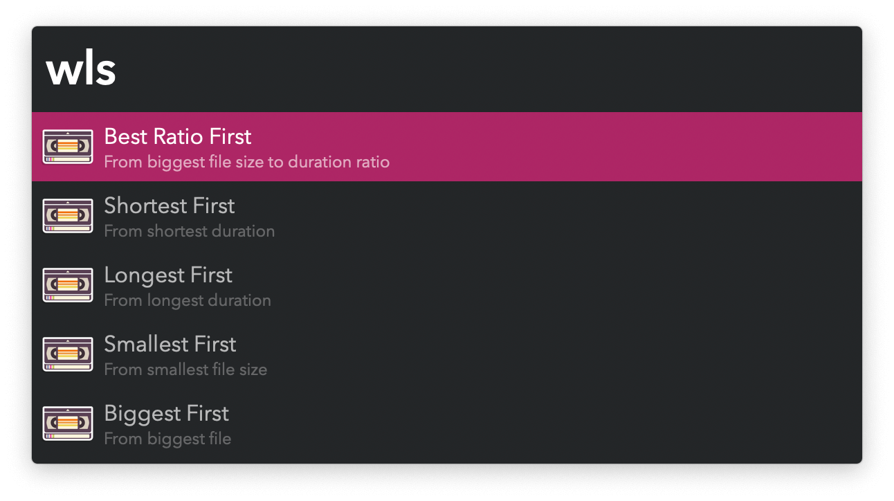
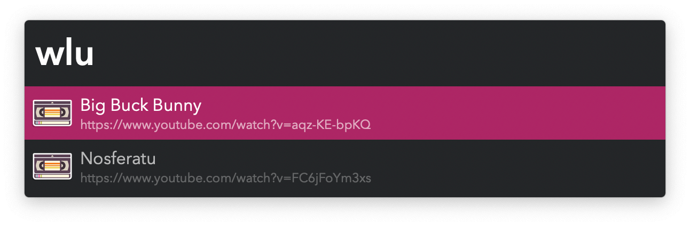

#  Watch List Alfred Workflow

Play and manage local media and streams

[⤓ Install on the Alfred Gallery](https://alfred.app/workflows/vitor/watch-list)

## Usage

Add files, series (folders), and streams (URLs) to your watchlist via the [Universal Action](https://www.alfredapp.com/help/features/universal-actions/).



Search through and play items from your list via the `wlp` keyword.



* <kbd>↩&#xFE0E;</kbd> Play.
* <kbd>⌃</kbd><kbd>↩&#xFE0E;</kbd> Open the item’s URL in a web browser.
* <kbd>⌥</kbd><kbd>↩&#xFE0E;</kbd> Download stream (requires [Download Media](https://alfred.app/workflows/vitor/download-media/)) or rescan folder for audiovisual files.
* <kbd>⌘</kbd><kbd>↩&#xFE0E;</kbd> Mark as watched without playing.
* <kbd>⇧</kbd><kbd>↩&#xFE0E;</kbd> Add to temporary playlist. Repeat for all desired items then <kbd>↩&#xFE0E;</kbd> to play in order. An unplayed playlist resets after a few minutes.
* <kbd>⌘</kbd><kbd>Y</kbd> [Quick Look](https://www.alfredapp.com/help/features/previews/) files and streams.

Sort your list in different ways with `wls`. Sorting is temporary and does not affect the main list’s order.



Add the frontmost browser URL to the list with `wlb`.


Manually edit the list via the `wle` keyword. A Text View will open for you to reorder and rename at will. Keep the initial six characters and colon together with a title. <kbd>⌘</kbd><kbd>↩&#xFE0E;</kbd> to apply the changes.


Undo marking an item as watched via the `wlu` keyword. <kbd>↩&#xFE0E;</kbd> to mark not watched and try to recover from the trash.



If the item has an origin URL (shown in the subtitle):

* <kbd>⌘</kbd><kbd>↩&#xFE0E;</kbd> Open URL in a web browser.
* <kbd>⌥</kbd><kbd>↩&#xFE0E;</kbd> Copy to the clipboard.
* <kbd>⌘</kbd><kbd>Y</kbd> [Quick Look](https://www.alfredapp.com/help/features/previews/).

### Subtitle reference:

There are three types of item: file, series, and stream. Each result has its name as the title. The subtitle details information following a template:

```
≈ (4) 𐄁 22m 32s 𐄁 691M 𐄁 /Some/Path
```

* `≈`: Indicates item is a stream.
    * file: N/A.
    * series: N/A.
    * stream: Always present.
* `(4)`: Number of elements.
    * file: N/A.
    * series: Remaining audiovisual files in folder.
    * stream: N/A for single items. Count of all items for playlists.
* `22m 32s`: Running time.
    * file: Running time of file.
    * series: Running time of first audiovisual file in folder.
    * stream: Combined running time of all elements.
* `691M`: Size.
    * file: Size of file.
    * series: Size of first audiovisual file in folder.
    * stream: N/A.
* `/Some/Path`: Path.
    * file: Path to file.
    * series: Path to folder.
    * stream: URL.

## Supported Players

All media players are supported, but not all are able to play streams. [mpv](http://mpv.io/), [IINA](https://iina.io/), and [VLC](http://www.videolan.org/vlc/index.html) are directly supported. With those, an item is not marked as watched if playback exits with a non-zero code. Take advantage of that to, for example, control when an item is marked as played and trashed. Disable the trashing behaviour entirely in the [Workflow’s Configuration](https://www.alfredapp.com/help/workflows/user-configuration/).
